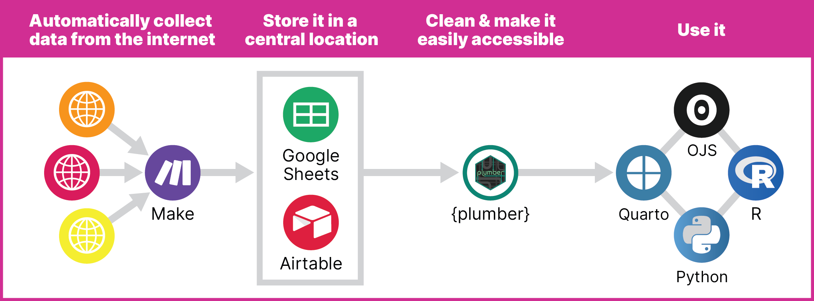

# DIY API with Make and {plumber}

Use [Make](https://www.make.com/en) and [{plumber}](https://www.rplumber.io/) to create your own API and show live data in [Quarto](https://quarto.org/) with [R](https://quarto.org/docs/computations/r.html) and [Observable JS](https://quarto.org/docs/computations/ojs.html).

[View the complete rendered book here](https://www.andrewheiss.com/blog/2024/01/12/diy-api-plumber-quarto-ojs/_book/), or see the [background blog post](https://www.andrewheiss.com/blog/2024/01/12/diy-api-plumber-quarto-ojs/) here.

